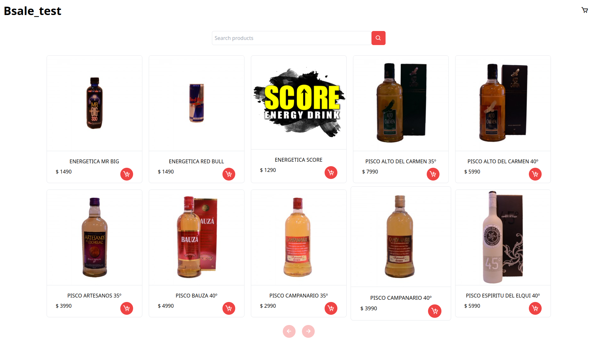
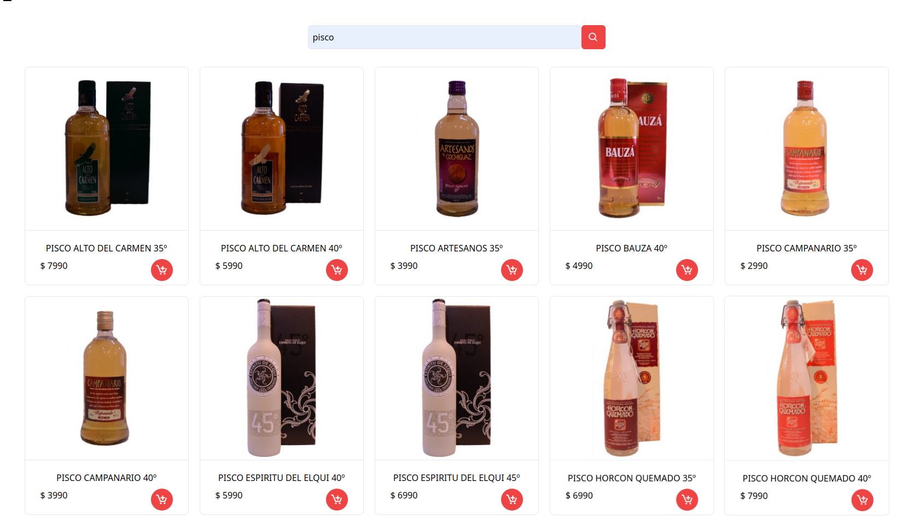
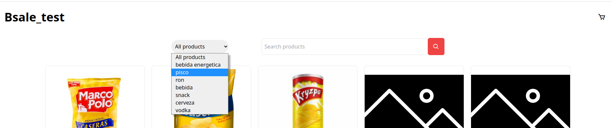

#Bsale_test_E-comerce

## Detalle de la aplicacion 

Construir una tienda online tomando en donde los usuarios puedan visualizar y consultar de los diversos productos, tomamos en cuenta la experiencia de usuario  agregando funcionalidades y una buena experiencia. 
La aplicacion fue hecha utilizando las siguientes tecnologias:

- *HTML*
- *javascript*
- *Tailwind CSS*
- *axios*

## Detalles de las funcionalidades
Al entrar a la pagina se mostraran todos los productos :

 

## Buscador de productos

Puedes buscar cualquier producto, tan solo debes poner el nombre y buscarlo:

**ejemplo**

 

## Si quieres busquedas mas detalladas puedes filtrar por sus categorias

Haz click en el menu de opciones y elige las categorias que te interesen.

## Paginacion 

Si quieres dirigirte a otra seccion y ver los productos que tenemos, lo puedes hacer solo haciendole click a las flechas

 

